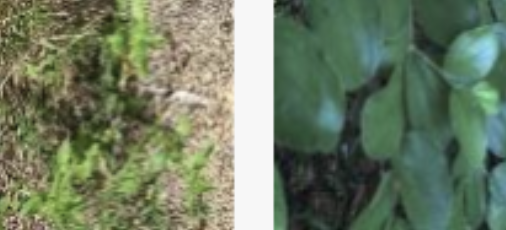

# Artifical Neural Networks and Deep Learning Challenges

This repository contains the challenges for the Artificial Neural Network and Deep Learning course.

## Challenge 1 - Image Classification of Plants 🌴🪴🌱

In this homework we were required to classify species of plants 
(like the ones in the example image below), which are divided into 
categories according to the species of the plant to which they belong. 
Being a classification problem, given an image, the goal is to predict 
the correct class label.

## Challenge 2 - Time Series Classification ⏳🛁𒀗

In this homework we were required to classify time series data,
which are divided into categories that we did not had any information about.
Being a classification problem, given a time series, the goal is to predict
the correct class label.

